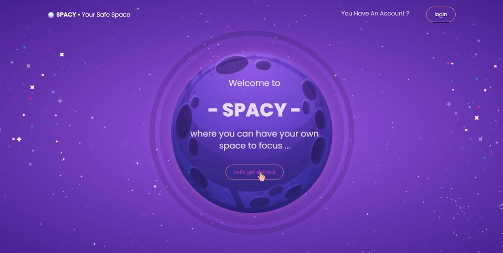

## SPACY Project 
SPACY is a website to create the user's own productive space where he/she can access multiple worlds like 
| Focus World | Todo World | Read World  |
| --- | --- | ---  |

> **_NOTE:_**  this is the backend of the actual project where you can find the frontend through [this link](https://github.com/hadilHelali/MyWorld_AngularProject_Front)
## Demo Video

## Collaborators

